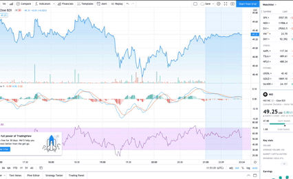

# Due Diligence for Dummies

Submission for HackWestern 7

## What it does

Due Diligence for Dummies lets a brand new investor look up any stock and see how individual and institutional investors are feeling about a particular stock. Ruling out complex numbers, graphs, and equations, gives them an opportunity to get a high level glance of the public’s opinion help them come to a decision on their own.

## Post-hackathon refactor demo

## What we refactored

We completely refactored our backend, getting rid of Node.js and running our server on Flask, since we realized most of our scraping and machine learning code was in Python, so using Javascript didn't make sense. We completely redesigned the front end, grabbing data from Yahoo Finance and providing a graph and additional price info. We also redesigned the summarized articles to be displayed in an easy to read and navigate card carousel.

## Old demo

## How it works

Due Diligence for Dummies works by providing our Python backend with a timeframe and stock symbol, which scrapes the internet in real-time for articles and posts about a stock and uses our natural language processing models to generate a sentiment analysis and summary of the material. Alongside that, we used React to display all the data for our frontend, and Redux and Express to communicate to our server.

## Links

https://devpost.com/software/due-diligence-for-dummies

https://www.youtube.com/watch?v=3-dMIlgXXBk&t=5s
